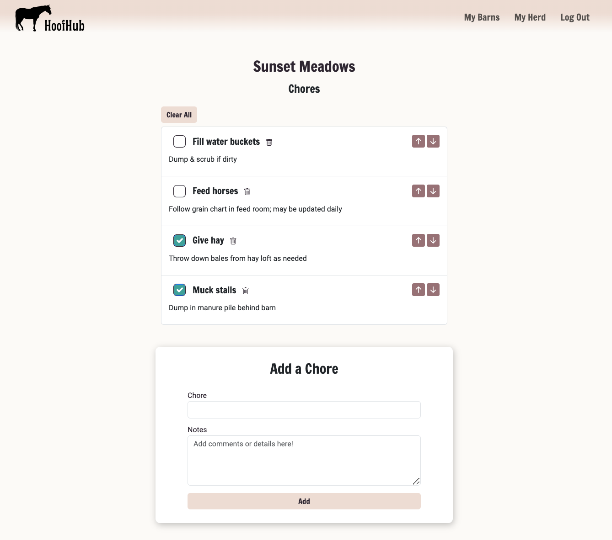

# 
HoofHub

### 
A horse care app for self-employed farm sitters and horse care professionals

## 
Introduction

HoofHub provides a platform for busy horse care professionals to keep all of their horse and barn notes organized and up to date in one place. With detailed horse and barn profiles, dedicated space for custom horse notes, and a chore management system for users to create, order and check off chores, HoofHub has everything a farm sitter needs to streamline their business workflow.

### 
Meet Kästlee, a self-employed farm sitter

Kästlee has been running her own farm sitting business for four years, but has never found an organizational system that meets her needs. She manages up to 6 barns at a time with up to 20 horses each, and keeps notes saved in the small details section of her calendar app. With this system, Kästlee finds it difficult to look up important information about specific horses and keep track of communication from the barn owners.

HoofHub eliminates the need for multiple apps, trackers and notes systems, and helps users like Kästlee stay focused on providing exceptional horse care. HoofHub continues to be developed with the unique needs of horse care professionals in mind.

## 
Using the HoofHub App

#### *Logging In*
HoofHub uses Google OAuth authentication system and users must be signed in to enjoy the app's features. Use the Sign In button to easily sign up using a Google account. HoofHub does not send emails to users.

#### *Horses and Barns*
Users can get started right away customizing the app to suit their needs. Barns and horses can be added by filling out a quick form, and horses can be assigned to barns from either the horse's details page or from the edit barn page. 

#### *Searching*
Finding a specific horse is easy with the search feature on the **My Herd** page. Quickly search for any horse from any barn using the search bar, or sort horses alphabetically by name or by age (ascending). Sort functionality is also available for each barn.

#### *Managing Chores*
Users who care for horses at multiple barns will enjoy HoofHub's chore management system, which allows for a customized chore list to be created for each barn. Users can add chores quickly with a simple form and use the up and down arrows to reorder the list to suit their needs. Checking off a chore moves it to the bottom of the list, and the Clear All button resets the list by un-checking all items on the list.

## 
Tech

### 

HTML, CSS, JavaScript | Node.js & Express.js | Mongoose & MongoDB | Bootstrap 5

&nbsp; 

### Mobile-Friendly User Interface
Because farm sitters are always on the go, it was important to me to build HoofHub with mobile use in mind. Users may choose to create and organize their notes using HoofHub's desktop layout on larger screens, but can also enjoy the same features on smaller screens with HoofHub's mobile-friendly user interface.

I taught myself Bootstrap specifically for this project because of its mobile-first approach to responsive design. Given the unique needs of HoofHub's target users, developing the app with a mobile-friendly user interface was a priority. Bootstrap 5's responsive grid system, form templates and other styling packages contributed to the consistent appearance and feel across all app pages and features.

## Next Steps

There are a number of additional features currently in development:

1. **Notebook** - A designated notebook page for each horse and barn for users to add quick notes

2. **Contact information for horses** - Space to add contacts for each horse, such as owner and veterinary information

3. **Sort chores by shift** - Assign chores to AM, PM, Midday or Overnight shifts

4. **Scheduling & Google Calendar integration** - Organize barns and chores into a schedule that can be exported to Google Calendar